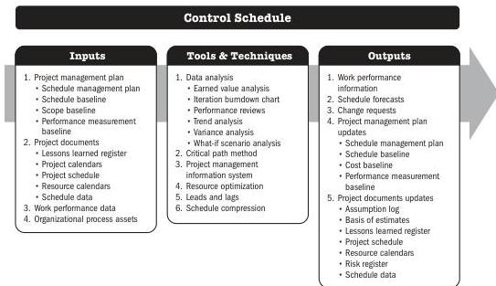

## 7.5 CONTROL SCHEDULE

Control Schedule is the process of monitoring the status of the project to update the project schedule and managing changes to the schedule baseline. The key benefit of this process is that the schedule baseline is maintained throughout the project.

*This process is performed throughout the project.* The inputs, tools and techniques, and outputs are shown in Figure 7-9. Figure 7-10 presents the data flow diagram for this process.

Note: This figure provides the inputs, tools and techniques, and outputs that may be used for this process. Descriptions for inputs and outputs appear in Section 9. Descriptions for tools and techniques appear in Section 10.

**Figure 7-9. Control Schedule: Inputs, Tools & Techniques, and Outputs**

Monitoring and Controlling Process Group

PMI Member benefit licensed to: Segun Fatoki - 4510107. Not for distribution, sale, or reproduction.

173