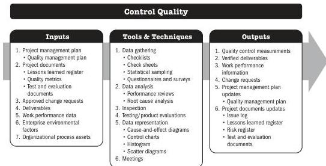

## 7.7 CONTROL QUALITY

Control Quality is the process of monitoring and recording results of executing the quality management activities in order to assess performance and ensure the project outputs are complete, correct, and meet customer expectations. The key benefit of this process is verifying that project deliverables and work meet the requirements specified by key stakeholders for final acceptance. The Control Quality process determines if the project outputs do what they were intended to do. Those outputs need to comply with all applicable standards, requirements, regulations, and specifications.

*This process is performed throughout the project.* The inputs, tools and techniques, and outputs are shown in Figure 7-13. Figure 7-14 presents the data flow diagram for this process.

Note: This figure provides the inputs, tools and techniques, and outputs that may be used for this process. Descriptions for inputs and outputs appear in Section 9. Descriptions for tools and techniques appear in Section 10.

Figure 7-13. Control Quality: Inputs, Tools & Techniques, and Outputs

Monitoring and Controlling Process Group

PMI Member benefit licensed to: Segun Fatoki - 4510107. Not for distribution, sale, or reproduction.

179