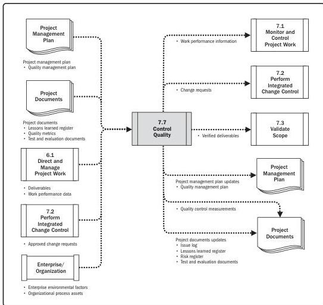

Note: This figure provides the inputs and outputs that may be used for this process.
Descriptions for inputs and outputs appear in Section 9.

**Figure 7-14. Control Quality: Data Flow Diagram**

The Control Quality process is performed to measure the completeness, compliance, and fitness for use of a product or service prior to user acceptance and final delivery. This is done by measuring all steps, attributes, and variables used to verify conformance or compliance to the specifications stated during the planning stage.

Quality control should be performed throughout the project to formally demonstrate, with reliable data, that the sponsor's and/or customer's acceptance criteria have been met.

180

Process Groups: A Practice Guide

PMI Member benefit licensed to: Segun Fatoki - 4510107. Not for distribution, sale, or reproduction.