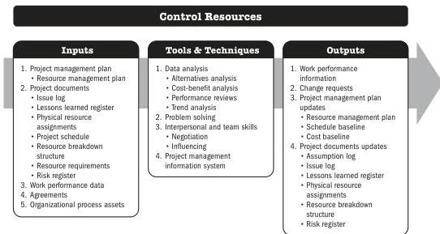

The level of effort to control quality and the degree of implementation may differ between industries and project management styles. For example, in the pharmaceutical, health, transportation, and nuclear industries, there may be stricter quality control procedures compared to other industries, and the effort needed to meet the standards may be extensive. In agile projects, the Control Quality activities may be performed by all team members throughout the project life cycle. In predictive (waterfall) model-based projects, the quality control activities are performed at specific times toward the end of the project or phase by specified team members.

## 7.8 CONTROL RESOURCES

Control Resources is the process of ensuring that the physical resources assigned and allocated to the project are available as planned, as well as monitoring the planned versus actual utilization of resources and taking corrective action as necessary. The key benefit of this process is ensuring that the assigned resources are available to the project at the right time and in the right place and are released when no longer needed.

*This process is performed throughout the project.* The inputs, tools and techniques, and outputs are shown in Figure 7-15. Figure 7-16 presents the data flow diagram for this process.

Note: This figure provides the inputs, tools and techniques, and outputs that may be used for this process. Descriptions for inputs and outputs appear in Section 9. Descriptions for tools and techniques appear in Section 10.

Figure 7-15. Control Resources: Inputs, Tools & Techniques, and Outputs

Monitoring and Controlling Process Group

PMI Member benefit licensed to: Segun Fatoki - 4510107. Not for distribution, sale, or reproduction.

181