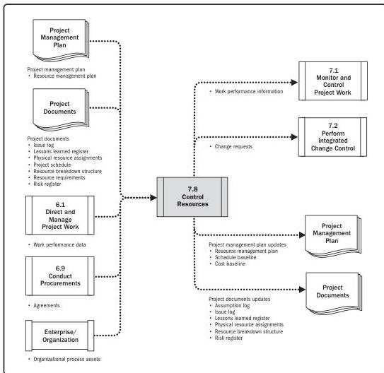

Note: This figure provides the inputs and outputs that may be used for this process.
Descriptions for inputs and outputs appear in Section 9.

**Figure 7-16. Control Resources: Data Flow Diagram**

The Control Resources process should be performed continuously in all project phases and throughout the project life cycle. The resources needed for the project should be assigned and released at the right time, right place, and in the right amount for the project to continue without delays. The Control Resources process is concerned with physical resources such as equipment, materials, facilities, and infrastructure. Team members are addressed in the Manage Team process.

182

Process Groups: A Practice Guide

PMI Member benefit licensed to: Segun Fatoki - 4510107. Not for distribution, sale, or reproduction.