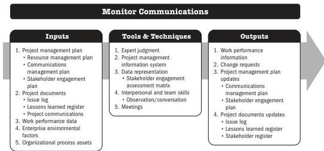

## 7.9 MONITOR COMMUNICATIONS

Monitor Communications is the process of ensuring the information needs of the project and its stakeholders are met. The key benefit of this process is the optimal information flow as defined in the communications management plan and the stakeholder engagement plan.

*This process is performed throughout the project.* The inputs, tools and techniques, and outputs are shown in Figure 7-17. Figure 7-18 presents the data flow diagram for this process.

Note: This figure provides the inputs, tools and techniques, and outputs that may be used for this process. Descriptions for inputs and outputs appear in Section 9. Descriptions for tools and techniques appear in Section 10.

**Figure 7-17. Monitor Communications: Inputs, Tools & Techniques, and Outputs**

184

Process Groups: A Practice Guide

PMI Member benefit licensed to: Segun Fatoki - 4510107. Not for distribution, sale, or reproduction.