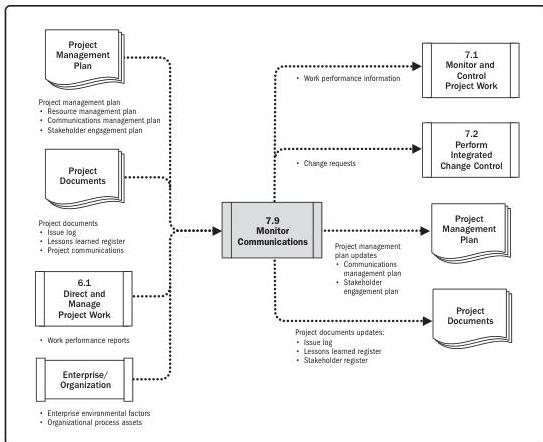

Note: This figure provides the inputs and outputs that may be used for this process.
Descriptions for inputs and outputs appear in Section 9.

**Figure 7-18. Monitor Communications: Data Flow Diagram**

Monitor Communications determines if the planned communications artifacts and activities have had the desired effect of increasing or maintaining stakeholders' support for the project's deliverables and expected outcomes. The impact and consequences of project communications should be carefully evaluated and monitored to ensure that the right message with the right content (the same meaning for sender and receiver) is delivered to the right audience, through the right channel, and at the right time. Monitor Communications may require a variety of methods, such as customer satisfaction surveys, collecting lessons learned, observations of the team, reviewing data from the issue log, or evaluating changes in the stakeholder engagement assessment matrix (refer to data representation in Section 10, Figure 10-22).

Monitoring and Controlling Process Group

185

PMI Member benefit licensed to: Segun Fatoki - 4510107. Not for distribution, sale, or reproduction.