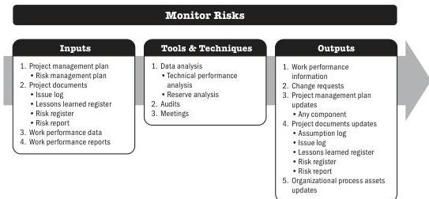

The Monitor Communications process can trigger an iteration of the Plan Communications Management and/or Manage Communications processes to improve the effectiveness of communication through additional and possibly amended communications plans and activities. Such iterations illustrate the continuous nature of the communications management processes. Issues or key performance indicators, risks, or conflicts may trigger an immediate revision.

## 7.10 MONITOR RISKS

Monitor Risks is the process of monitoring the implementation of agreed-upon risk response plans, tracking identified risks, identifying and analyzing new risks, and evaluating risk process effectiveness throughout the project. The key benefit of this process is that it enables project decisions to be based on current information about overall project risk exposure and individual project risks.

*This process is performed throughout the project.* The inputs, tools and techniques, and outputs are shown in Figure 7-19. Figure 7-20 presents the data flow diagram for this process.

Note: This figure provides the inputs, tools and techniques, and outputs that may be used for this process. Descriptions for inputs and outputs appear in Section 9. Descriptions for tools and techniques appear in Section 10.

**Figure 7-19. Monitor Risks: Inputs, Tools & Techniques, and Outputs**

PMI Member benefit licensed to: Segun Fatoki - 4510107. Not for distribution, sale, or reproduction.

186

Process Groups: A Practice Guide