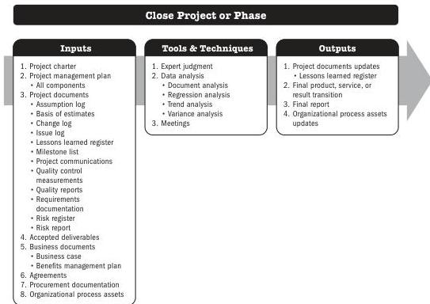

## 8.1 CLOSE PROJECT OR PHASE

Close Project or Phase is the process of finalizing all activities for the project, phase, or contract. The key benefits of this process are the project or phase information is archived, the planned work is completed, and organizational team resources are released to pursue new endeavors.

*This process is performed once or at predefined points in the project.* The inputs, tools and techniques, and outputs are shown in Figure 8-1. Figure 8-2 presents the data flow diagram for the process.

Note: This figure provides the inputs, tools and techniques, and outputs that may be used for this process. Descriptions for inputs and outputs appear in Section 9. Descriptions for tools and techniques appear in Section 10.

**Figure 8-1. Close Project or Phase: Inputs, Tools & Techniques, and Outputs**

196

Process Groups: A Practice Guide

PMI Member benefit licensed to: Segun Fatoki - 4510107. Not for distribution, sale, or reproduction.