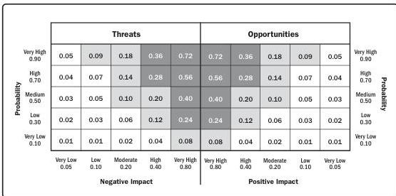

Figure 9-1. Example Probability and Impact Matrix with Scoring Scheme

**Procurement documentation.** All documents used in signing, executing, and closing an agreement. Procurement documentation may include documents predating the project. Procurement documentation contains complete supporting records for administration of the procurement processes. Procurement documentation includes the statement of work, payment information, contractor work performance information, plans, drawings, and other correspondence.

**Procurement documentation updates.** Procurement documentation that may be updated includes the contract with all supporting schedules, requested unapproved contract changes, and approved change requests. Procurement documentation also includes any seller-developed technical documentation and other work performance information such as deliverables, seller performance reports and warranties, financial documents including invoices and payment records, and the results of contract-related inspections.

**Procurement management plan.** A component of the project or program management plan that describes how a project team will acquire goods and services from outside of the performing organization.

Inputs and Outputs

PMI Member benefit licensed to: Segun Fatoki - 4510107. Not for distribution, sale, or reproduction.

215