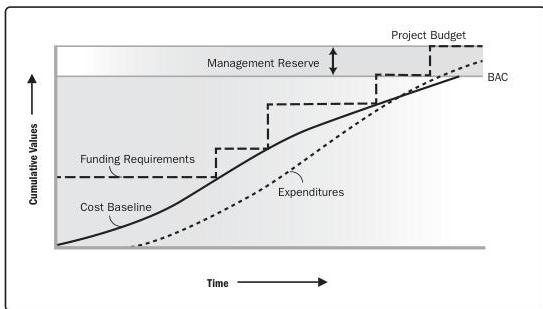

**Project documents updates.** The documentation that is updated throughout the five Process Groups to initiate, plan, execute, manage and control, close, and deliver the project. There are 33 project documents listed in Table 1-6 of this practice guide. Examples include change log, issue log, project schedule, project scope statement, requirements documentation, risk register, and stakeholder register.

**Project funding requirements.** Total funding requirements and periodic funding requirements (e.g., quarterly, annually) are derived from the cost baseline. The cost baseline includes projected expenditures plus anticipated liabilities. Funding often occurs in incremental amounts, and may not be evenly distributed, which appear as steps in Figure 9-2. The total funds required are those included in the cost baseline plus management reserves, if any. Funding requirements may include the source(s) of the funding. The budget at completion (BAC) is the sum of all budgets established for the work to be performed.

Figure 9-2. Cost Baseline, Expenditures, and Funding Requirements

**Project life cycle description.** The project life cycle determines the series of phases that a project passes through from its inception to the end of the project.

**Project management plan.** The document that describes how the project will be executed, monitored and controlled, and closed.

Inputs and Outputs

PMI Member benefit licensed to: Segun Fatoki - 4510107. Not for distribution, sale, or reproduction.

219