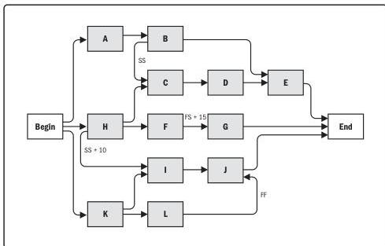

**Project management plan updates.** Updates to the document that describes how the project is being executed, monitored and controlled, and closed.

**Project schedule.** A schedule model output that presents linked activities with planned dates, durations, milestones, and resources. The detailed project schedule should be flexible throughout the project to adjust for the knowledge gained, increased understanding of the risks, and value-added activities.

**Project schedule network diagrams.** A project schedule network diagram is a graphical representation of the logical relationships, also referred to as dependencies, among the project schedule activities. Figure 9-3 illustrates a project schedule network diagram. A project schedule network diagram is produced manually or by using project management software. It can include full project details or have one or more summary activities. A summary narrative can accompany the diagram and describe the basic approach used to sequence the activities. Any unusual activity sequences within the network should be fully described within the narrative.

Activities that have multiple predecessor activities indicate a path convergence. Activities that have multiple successor activities indicate a path divergence. Activities with divergence and convergence are at greater risk as they are affected by multiple activities or can affect multiple activities. Activity I is called a path convergence, as it has more than one predecessor, while activity K is called a path divergence, as it has more than one successor.

Figure 9-3. Example of Project Schedule Network Diagram

220

Process Groups: A Practice Guide

PMI Member benefit licensed to: Segun Fatoki - 4510107. Not for distribution, sale, or reproduction.