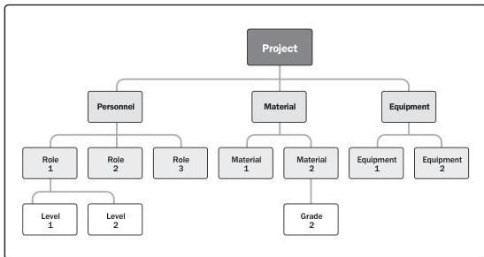

|  Requirements Traceability Matrix  |   |   |   |   |   |   |   |   |
| --- | --- | --- | --- | --- | --- | --- | --- | --- |
|  Project Name: |   |   |   |   |   |   |   |   |
|  Cost Center: |   |   |   |   |   |   |   |   |
|  Project Description: |   |   |   |   |   |   |   |   |
|  ID | Associate ID | Requirements Description | Business Needs, Opportunities, Goals, Objectives | Project Objectives | WBS Deliverables | Product Design | Product Development | Test Cards  |
|  001 | 1.0 |  |  |  |  |  |  |   |
|   |  1.1 |  |  |  |  |  |  |   |
|   |  1.2 |  |  |  |  |  |  |   |
|   |  1.2.1 |  |  |  |  |  |  |   |
|  002 | 2.0 |  |  |  |  |  |  |   |
|   |  2.1 |  |  |  |  |  |  |   |
|   |  2.1.1 |  |  |  |  |  |  |   |
|  003 | 3.0 |  |  |  |  |  |  |   |
|   |  3.1 |  |  |  |  |  |  |   |
|   |  3.2 |  |  |  |  |  |  |   |
|  004 | 4.0 |  |  |  |  |  |  |   |
|  005 | 5.0 |  |  |  |  |  |  |   |

Figure 9-4. Example of a Requirements Traceability Matrix

Figure 9-5. Sample Resource Breakdown Structure

Inputs and Outputs

PMI Member benefit licensed to: Segun Fatoki - 4510107. Not for distribution, sale, or reproduction.

227