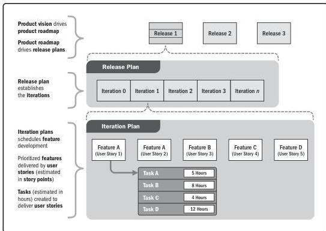

Figure 10-1. Relationship between Product Vision, Release Planning, and Iteration Planning

**Alternatives analysis.** Used to evaluate identified options in order to select the options or approaches to use to execute and perform project work. Alternatives analysis assists in providing the best solution to perform project activities, within the defined constraints.

**Analogous estimating.** Analogous estimating is a technique for estimating the duration or cost of an activity or a project using historical data from a similar activity or project. Analogous estimating uses parameters from a previous, similar project, such as duration, budget, size, weight, and complexity, as the basis for estimating the same parameter or measure for a future project. When estimating durations, this technique relies on the actual duration of previous, similar projects as the basis for estimating the duration of the current project. It is a gross value estimating approach, sometimes adjusted for known differences in project complexity. Analogous duration estimating is frequently used to estimate project duration when there is a limited amount of detailed information about the project.

246

Process Groups: A Practice Guide

PMI Member benefit licensed to: Segun Fatoki - 4510107. Not for distribution, sale, or reproduction.