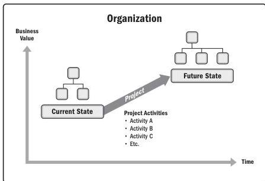

Figure 1-1. Organizational State Transition via a Project

## 1.2.2 PROJECTS ENABLE BUSINESS VALUE CREATION

PMI defines business value as the net quantifiable benefit derived from a business endeavor. The benefit may be tangible, intangible, or both. In business analysis, business value is considered the return, in the form of elements such as time, money, goods, or intangibles in return for something. Business value in projects refers to the benefit that the results of a specific project provide to its stakeholders. The benefit from projects may be tangible, intangible, or both.

6

Process Groups: A Practice Guide

PMI Member benefit licensed to: Segun Fatoki - 4510107. Not for distribution, sale, or reproduction.