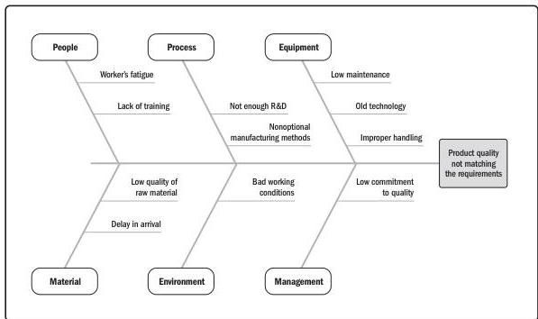

**Cause-and-effect diagrams.** Cause-and-effect diagrams are also known as fishbone diagrams, why-why diagrams, or Ishikawa diagrams. This type of diagram breaks down the causes of the problem statement identified into discrete branches, helping to identify the main or root cause of the problem. Figure 10-2 is an example of a cause-and-effect diagram.

Figure 10-2. Cause-and-Effect Diagram

**Change control tools.** Manual or automated tools to assist with change and/or configuration management. At a minimum, the tools should support the activities of the change control board (CCB).

250

Process Groups: A Practice Guide

PMI Member benefit licensed to: Segun Fatoki - 4510107. Not for distribution, sale, or reproduction.