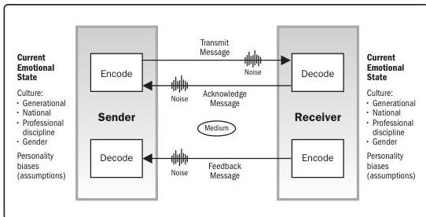

This communication model and its enhancements can assist in developing communication strategies and plans for person-to-person or even small-group-to-small-group communications. It is not useful for other communications artifacts such as emails, broadcast messages, or social media.

Figure 10-4. Communication Model for Cross-Cultural Communication

**Communication requirements analysis.** An analytical technique to determine the information needs of the project stakeholders through interviews, workshops, study of lessons learned from previous projects, etc. Analysis of communication requirements determines the information needs of the project stakeholders. These requirements are defined by combining the type and format of information needed with an analysis of the value of that information.

Sources of information typically used to identify and define project communication requirements include but are not limited to:

- Stakeholder information and communication requirements from within the stakeholder register and stakeholder engagement plan;
- Number of potential communication channels or paths, including one-to-one, one-to-many, and many-to-many communications;

256

Process Groups: A Practice Guide

PMI Member benefit licensed to: Segun Fatoki - 4510107. Not for distribution, sale, or reproduction.