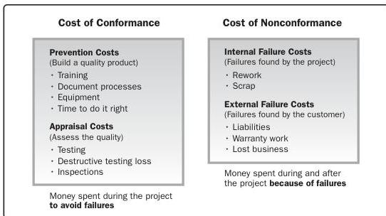

Figure 10-5. Cost of Quality

**Critical path method.** The critical path method is used to estimate the minimum project duration and determine the amount of schedule flexibility on the logical network paths within the schedule model. This schedule network analysis technique calculates the early start, early finish, late start, and late finish dates for all activities without regard for any resource limitations by performing a forward and backward pass analysis through the schedule network, as shown in Figure 10-6. In this example, the longest path includes activities A, C, and D, and therefore, the sequence of A-C-D is the critical path. The critical path is the sequence of activities that represents the longest path through a project, which determines the shortest possible project duration. The longest path has the least total float—usually zero. The resulting early and late start and finish dates are not necessarily the project schedule; rather they indicate the time periods within which the activity could be executed, using the parameters entered in the schedule model for activity durations, logical relationships, leads, lags, and other known constraints. The critical path method is used to calculate the critical path(s) and the amount of total and free float or schedule flexibility on the logical network paths within the schedule model.

262

Process Groups: A Practice Guide

PMI Member benefit licensed to: Segun Fatoki - 4510107. Not for distribution, sale, or reproduction.