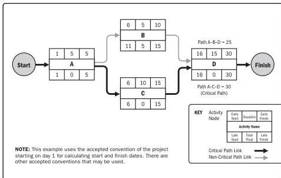

Figure 10-6. Example of Critical Path Method

On any network path, the total float or schedule flexibility is measured by the amount of time that a schedule activity can be delayed or extended from its early start date without delaying the project finish date or violating a schedule constraint. A critical path is normally characterized by zero total float on the critical path. As implemented with the precedence diagramming method sequencing, critical paths may have positive, zero, or negative total float depending on the constraints applied. Positive total float is caused when the backward pass is calculated from a schedule constraint that is later than the early finish date that has been calculated during forward pass calculation. Negative total float is caused when a constraint on the late dates is violated by duration and logic. Negative float analysis is a technique that helps to find possible accelerated ways of bringing a delayed schedule back on track. Schedule networks may have multiple near-critical paths. Many software packages allow the user to define the parameters used to determine the critical path(s). Adjustments to activity durations (when more resources or less scope can be arranged), logical relationships (when the relationships were discretionary to begin with), leads and lags, or other schedule constraints may be necessary to produce network paths with a zero or positive total float. Once the total float and the free float have been calculated, the free float is the amount of time that a schedule activity can be delayed without delaying the early start date of any successor or violating a schedule constraint. For example, the free float for Activity B, in Figure 10-6, is 5 days.

Tools and Techniques

PMI Member benefit licensed to: Segun Fatoki - 4510107. Not for distribution, sale, or reproduction.

263