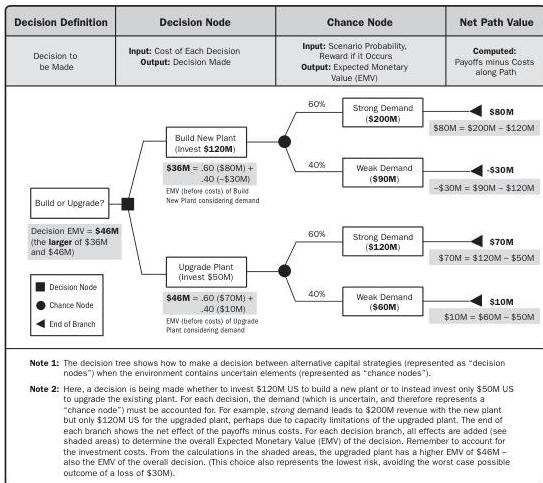

A decision tree is evaluated by calculating the expected monetary value of each branch, allowing the optimal path to be selected. An example of a decision tree is shown in Figure 10-7.

Figure 10-7. Example Decision Tree

Tools and Techniques

PMI Member benefit licensed to: Segun Fatoki - 4510107. Not for distribution, sale, or reproduction.

265