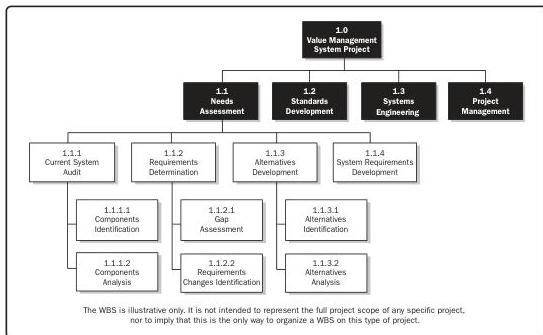

**Decomposition.** A technique used for dividing and subdividing the project scope and project deliverables into smaller, more manageable parts. The work package is the work defined at the lowest level of the work breakdown structure (WBS) for which cost and duration can be estimated and managed. The level of decomposition is often guided by the degree of control needed to effectively manage the project. The level of detail for work packages varies depending on the size and complexity of the project. Decomposition of the total project work into work packages generally involves the following activities:

- Identifying and analyzing the deliverables and related work,
- Structuring and organizing the WBS,
- Decomposing the upper WBS levels into lower-level detailed components,
- Developing and assigning identification codes to the WBS components, and
- Verifying that the degree of decomposition of the deliverables is appropriate.

A portion of a WBS with some branches of the WBS decomposed down through the work package level is shown in Figure 10-8.

Figure 10-8. Sample WBS Decomposed Down through Work Packages

266

Process Groups: A Practice Guide

PMI Member benefit licensed to: Segun Fatoki - 4510107. Not for distribution, sale, or reproduction.