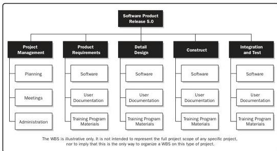

A WBS structure may be created through various approaches. Some of the popular methods include the top-down approach, the use of organization-specific guidelines, and the use of WBS templates. A bottom-up approach can be used to group subcomponents. The WBS structure can be represented in various forms, such as:

- Using phases of the project life cycle as the second level of decomposition, with the product and project deliverables inserted at the third level, as shown in Figure 10-9;
- Using major deliverables as the second level of decomposition, as shown in Figure 10-10; and
- Incorporating subcomponents that may be developed by organizations outside the project team, such as contracted work. The seller then develops the supporting contract WBS as part of the contracted work.

Figure 10-9. Sample WBS Organized by Phase

Tools and Techniques

PMI Member benefit licensed to: Segun Fatoki - 4510107. Not for distribution, sale, or reproduction.

267