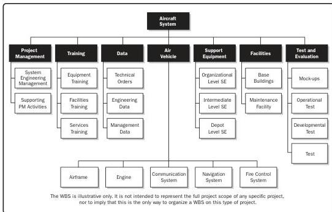

**Figure 10-10. Sample WBS with Major Deliverables**

Decomposition of the upper-level WBS components requires subdividing the work for each of the deliverables or subcomponents into its most fundamental components, where the WBS components represent verifiable products, services, or results. If an agile approach is used, epics can be decomposed into user stories. The WBS may be structured as an outline, an organizational chart, or other method that identifies a hierarchical breakdown. Verifying the correctness of the decomposition requires determining that the lower-level WBS components are those that are necessary and sufficient for completion of the corresponding higher-level deliverables. Different deliverables can have different levels of decomposition. To arrive at a work package, the work for some deliverables needs to be decomposed only to the next level, while others need additional levels of decomposition. As the work is decomposed to greater levels of detail, the ability to plan, manage, and control the work is enhanced. However, excessive decomposition can lead to nonproductive management effort, inefficient use of resources, decreased efficiency in performing the work, and difficulty aggregating data over different levels of the WBS.

268

Process Groups: A Practice Guide

PMI Member benefit licensed to: Segun Fatoki - 4510107. Not for distribution, sale, or reproduction.