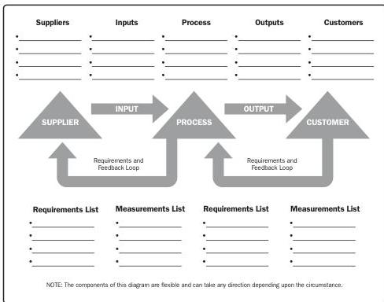

**Flowcharts.** Flowcharts are also referred to as process maps because they display the sequence of steps and the branching possibilities that exist for a process that transforms one or more inputs into one or more outputs. Flowcharts show the activities, decision points, branching loops, parallel paths, and the overall order of processing by mapping the operational details of procedures that exist within a horizontal value chain. One version of a value chain, known as a SIPOC (suppliers, inputs, process, outputs, and customers) model, is shown in Figure 10-11. Flowcharts may prove useful in understanding and estimating the cost of quality for a process. Information is obtained by using the workflow branching logic and associated relative frequencies to estimate the expected monetary value for the conformance and nonconformance work required to deliver the expected conforming output. When flowcharts are used to represent the steps in a process, they are sometimes called process flows or process flow diagrams and they can be used for process improvement as well as identifying where quality defects can occur or where to incorporate quality checks.

Figure 10-11. The SIPOC Model

Tools and Techniques

PMI Member benefit licensed to: Segun Fatoki - 4510107. Not for distribution, sale, or reproduction.

273