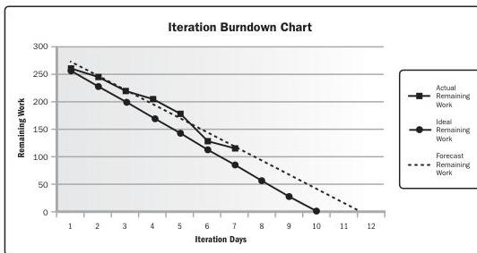

**Inspection.** An inspection is the examination of a work product to determine if it conforms to documented standards. The results of inspections generally include measurements and may be conducted at any level. The results of a single activity can be inspected, or the final product of the project can be inspected. Inspections may be called reviews, peer reviews, audits, or walkthroughs. In some application areas, these terms have narrow and specific meanings. Inspections also are used to verify defect repairs.

**Interviews.** A formal or informal approach to elicit information from stakeholders by talking to them directly. It is typically performed by asking prepared and spontaneous questions and recording the responses. Interviews are often conducted on an individual basis between an interviewer and an interviewee but may involve multiple interviewers and/or multiple interviewees. Interviewing experienced project participants, sponsors, other executives, and subject matter experts can aid in identifying and defining the features and functions of the desired product deliverables. Interviews are also useful for obtaining confidential information.

**Iteration burndown chart.** This chart tracks the work that remains to be completed in the iteration backlog. It is used to analyze the variance with respect to an ideal burndown based on the work committed from iteration planning. A forecast trend line can be used to predict the likely variance at iteration completion and take appropriate actions during the course of the iteration. A diagonal line representing the ideal burndown and daily actual remaining work is then plotted. A trend line is then calculated to forecast completion based on remaining work. Figure 10-12 is an example of an iteration burndown chart.

Figure 10-12. Iteration Burndown Chart

Tools and Techniques

PMI Member benefit licensed to: Segun Fatoki - 4510107. Not for distribution, sale, or reproduction.

277