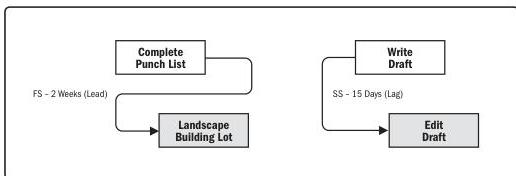

**Leadership.** The knowledge, skills, and behaviors needed to guide, motivate, and direct a team to help an organization achieve its business goals. These skills may include demonstrating essential capabilities such as negotiation, resilience, communication, problem solving, critical thinking, and interpersonal skills. Projects are becoming increasingly more complicated with more and more businesses executing their strategy through projects. Project management is more than just working with numbers, templates, charts, graphs, and computing systems. A common denominator in all projects is people. People can be counted, but they are not numbers.

**Leads and lags.** A lead is the amount of time a successor activity can be advanced with respect to a predecessor activity. For example, on a project to construct a new office building, the landscaping could be scheduled to start 2 weeks prior to the scheduled punch list completion. This would be shown as a finish-to-start with a 2-week lead as shown in Figure 10-13. A lead is often represented as a negative value for lag in scheduling software.

Figure 10-13. Examples of Lead and Lag

A lag is the amount of time a successor activity will be delayed with respect to a predecessor activity. For example, a technical writing team may begin editing the draft of a large document 15 days after they begin writing it. This can be shown as a start-to-start relationship with a 15-day lag as shown in Figure 10-13. Lag can also be represented in project schedule network diagrams, as shown in Figure 10-14, in the relationship between activities H and I (as indicated by the nomenclature SS+10 (start-to-start plus 10 days lag) even though the offset is not shown relative to a timescale).

Tools and Techniques

PMI Member benefit licensed to: Segun Fatoki - 4510107. Not for distribution, sale, or reproduction.

279