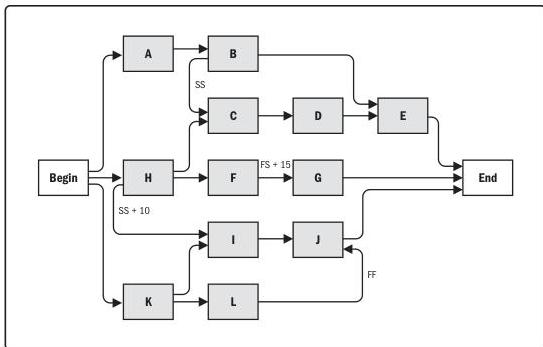

Figure 10-14. Project Schedule Network Diagram

The project management team determines the dependencies that may require a lead or a lag to accurately define the logical relationship. The use of leads and lags should not replace schedule logic. Also, duration estimates do not include any leads or lags. Activities and their related assumptions should be documented.

**Logical data model.** A logical data model is a visual representation of an organization's data, described in business language and independent of any specific technology. A logical data model can be used to identify where data integrity or other quality issues can arise.

**Make-or-buy analysis.** A make-or-buy analysis is used to determine whether work or deliverables can best be accomplished by the project team or should be purchased from outside sources. Factors to consider in the make-or-buy decision include the organization's current resource allocation and their skills and abilities, the need for specialized expertise, the desire to not expand permanent employment obligations, and the need for independent expertise. It also includes evaluating the risks involved with each make-or-buy decision.

280

Process Groups: A Practice Guide

PMI Member benefit licensed to: Segun Fatoki - 4510107. Not for distribution, sale, or reproduction.