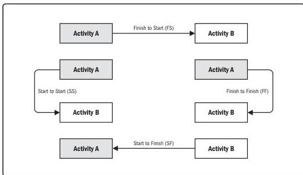

- ▶ **Finish-to-finish (FF).** A logical relationship in which a successor activity cannot finish until a predecessor activity has finished. For example, writing a document (predecessor) is required to finish before editing the document (successor) can finish.
- ▶ **Start-to-start (SS).** A logical relationship in which a successor activity cannot start until a predecessor activity has started. For example, leveling concrete (successor) cannot begin until pouring the foundation (predecessor) begins.
- ▶ **Start-to-finish (SF).** A logical relationship in which a predecessor activity cannot finish until a successor activity has started. For example, a new accounts payable system (successor) has to start before the old accounts payable system can be shut down (predecessor).

In PDM, FS is the most commonly used type of precedence relationship. The SF relationship is very rarely used, but it is included here to present a complete list of the PDM relationship types.

Two activities can have two logical relationships at the same time (for example, SS and FF). Multiple relationships between the same activities are not recommended, so a decision has to be made to select the relationship with the highest impact. Closed loops are also not recommended in logical relationships.

Figure 10-15. Precedence Diagramming Method (PDM) Relationship Types

Tools and Techniques

PMI Member benefit licensed to: Segun Fatoki - 4510107. Not for distribution, sale, or reproduction.

285