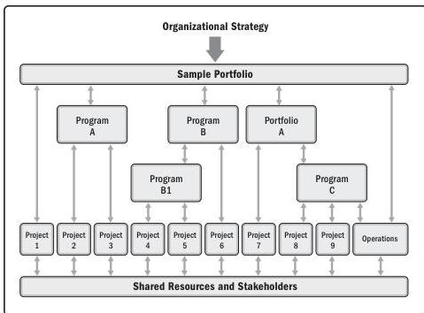

Figure 1-2. Example of Portfolio, Program, and Project Management Interfaces

Table 1-2 gives a comparative overview of portfolios, programs, and projects.

10

Process Groups: A Practice Guide

PMI Member benefit licensed to: Segun Fatoki - 4510107. Not for distribution, sale, or reproduction.