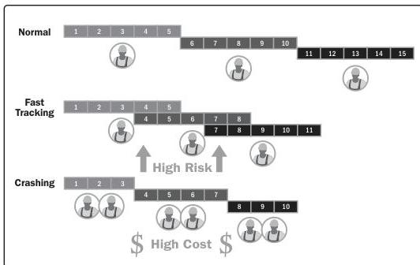

Figure 10-19. Schedule Compression Comparison

**Schedule network analysis.** Schedule network analysis is a technique to identify early and late start dates, including early and late finish dates, for the uncompleted portions of project activities. Schedule network analysis is the overarching technique used to generate the project schedule model. It employs several other techniques such as critical path method, resource optimization techniques, and modeling techniques. Additional analysis includes but is not limited to:

- Assessing the need to aggregate schedule reserves to reduce the probability of a schedule slip when multiple paths converge at a single point in time, or when multiple paths diverge from a single point in time, to reduce the probability of a schedule slip.
- Reviewing the network to see if the critical path has high-risk activities or long-lead items that would necessitate use of schedule reserves or the implementation of risk responses to reduce the risk on the critical path.

Schedule network analysis is an iterative process that is employed until a viable schedule model is developed.

296

Process Groups: A Practice Guide

PMI Member benefit licensed to: Segun Fatoki - 4510107. Not for distribution, sale, or reproduction.