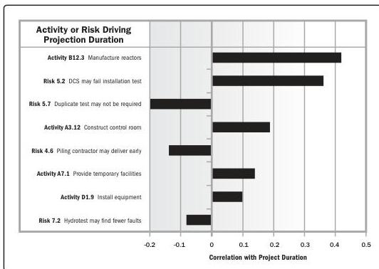

**Sensitivity analysis.** An analysis technique to determine which individual project risks or other sources of uncertainty have the most potential impact on project outcomes, by correlating variations in project outcomes with variations in elements of a quantitative risk analysis model.

Sensitivity analysis helps to determine which individual project risks or other sources of uncertainty have the most potential impact on project outcomes. It correlates variations in project outcomes with variations in elements of the quantitative risk analysis model.

One typical display of sensitivity analysis is the tornado diagram, which presents the calculated correlation coefficient for each element of the quantitative risk analysis model that can influence the project outcome. This can include individual project risks, project activities with high degrees of variability, or specific sources of ambiguity. Items are ordered by descending strength of correlation, giving the typical tornado appearance. An example tornado diagram is shown in Figure 10-20.

Figure 10-20. Example of a Tornado Diagram

Tools and Techniques

PMI Member benefit licensed to: Segun Fatoki - 4510107. Not for distribution, sale, or reproduction.

297