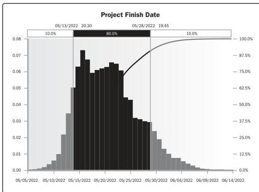

**Simulation.** Simulation models the combined effects of individual project risks and other sources of uncertainty to evaluate their potential impact on achieving project objectives. The most common simulation technique is Monte Carlo analysis, in which risks and other sources of uncertainty are used to calculate possible schedule outcomes for the total project. Simulation involves calculating multiple work package durations with different sets of activity assumptions, constraints, risks, issues, or scenarios using probability distributions and other representations of uncertainty. Figure 10-21 shows a probability distribution for a project with the probability of achieving a certain target date (i.e., project finish date). In this example, there is a 10% probability that the project will finish on or before the target date of 13 May 2022, while there is a 90% probability of completing the project by 28 May 2022.

Figure 10-21. Example of a Probability Distribution of a Target Milestone

For more information on how Monte Carlo simulation is used for schedule models, see the *Practice Standard for Scheduling* [8].

298

Process Groups: A Practice Guide

PMI Member benefit licensed to: Segun Fatoki - 4510107. Not for distribution, sale, or reproduction.