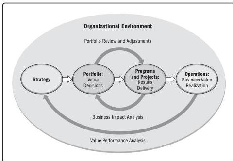

## 1.6 ORGANIZATIONAL PROJECT MANAGEMENT (OPM)

Organizational project management (OPM) is a strategy execution framework utilizing portfolio, program, and project management. It provides a framework that enables organizations to consistently and predictably deliver on organizational strategy, producing better performance; better results; and a sustainable, competitive advantage.

Figure 1-3 shows the organizational environment where strategy, a portfolio, programs and projects, and operations interact.

Figure 1-3. Organizational Project Management

For more information on OPM, refer to *The Standard for Organizational Project Management* [2].

12

Process Groups: A Practice Guide

PMI Member benefit licensed to: Segun Fatoki - 4510107. Not for distribution, sale, or reproduction.