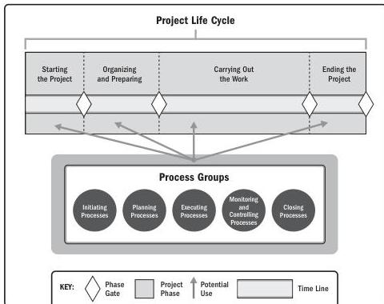

## 1.7.1 PROJECT AND DEVELOPMENT LIFE CYCLES

A project life cycle is the series of phases that a project passes through from its start to its completion. It provides the basic framework for managing the project. This basic framework applies regardless of the specific project work involved. The phases may be sequential, iterative, or overlapping. All projects can be mapped to the generic life cycle shown in Figure 1-4.

Figure 1-4. Interrelationship of Key Components in Projects

Project life cycles can be predictive or adaptive. Within a project life cycle, there are generally one or more phases that are associated with the development of the product, service, or result. These are called development life cycles, which can be predictive, adaptive, iterative, incremental, or a hybrid model:

14

Process Groups: A Practice Guide

PMI Member benefit licensed to: Segun Fatoki - 4510107. Not for distribution, sale, or reproduction.