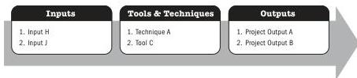

Figure 1-5. Example Process: Inputs, Tools & Techniques, and Outputs

The number of process iterations and interactions between processes varies based on the needs of the project. Processes generally fall into one of three categories:

- ▶ **Processes used once or at predefined points in the project.** The processes *Develop Project Charter* and *Close Project or Phase* are examples.
- ▶ **Processes that are performed periodically as needed.** The process *Acquire Resources* is performed as resources are needed. The process *Conduct Procurements* is performed prior to needing the procured item.
- ▶ **Processes that are performed continuously throughout the project.** The process *Define Activities* may occur throughout the project life cycle, especially if the project uses rolling wave planning or an adaptive development approach. Many of the Monitoring and Controlling processes are ongoing from the start of the project, until it is closed out.

Project management is accomplished through the appropriate application and integration of logically grouped project management processes. While there are different ways of grouping processes, PMI groups processes into five categories called Process Groups (see Section 1.7.5).

20

Process Groups: A Practice Guide

PMI Member benefit licensed to: Segun Fatoki - 4510107. Not for distribution, sale, or reproduction.