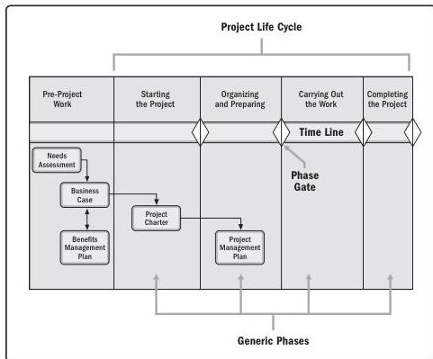

Project managers tailor the noted project management documents for their projects. In some organizations, the business case and benefits management plan are maintained at the program level. Project managers then work with the appropriate program managers to ensure the project management documents are aligned with the program documents. Figure 1-7 illustrates the interrelationship of these critical project management business documents and the needs assessment. Figure 1-7 shows an approximation of the life cycle of these various documents against the project life cycle.

Figure 1-7. Interrelationship of Needs Assessment and Critical Business/Project Documents

30

Process Groups: A Practice Guide

PMI Member benefit licensed to: Segun Fatoki - 4510107. Not for distribution, sale, or reproduction.