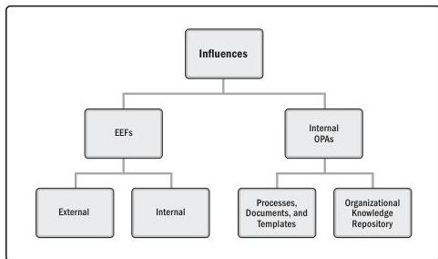

2

# The Project Environment

Projects exist and operate in environments that may have an influence on them. These influences can have a favorable or unfavorable impact on the project. Two major categories of influences are enterprise environmental factors (EEFs) and organizational process assets (OPAs).

EEFs originate from the environment outside of the project, and often outside of the enterprise. EEFs may have an impact at the organizational, portfolio, program, or project level.

OPAs are internal to the organization. These may arise from the organization itself, a portfolio, a program, another project, or a combination of these. Figure 2-1 shows the breakdown of project influences into EEFs and OPAs.

Figure 2-1. Project Influences

In addition to EEFs and OPAs, governance plays a significant role in the life cycle of the project (see Section 2.3).

37

PMI Member benefit licensed to: Segun Fatoki - 4510107. Not for distribution, sale, or reproduction.