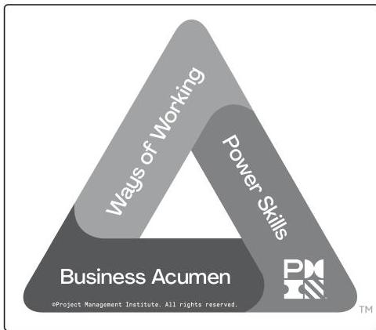

## 3.2 PROJECT MANAGER COMPETENCES

Recent PMI studies applied the *Project Manager Competency Development (PMCD) Framework* [6] to the skills needed by project managers through the use of the PMI Talent Triangle® shown in Figure 3-2. The Talent Triangle focuses on three key skill sets: Ways of Working, Business Acumen, and Power Skills.

Figure 3-2. The PMI Talent Triangle®

58

Process Groups: A Practice Guide

PMI Member benefit licensed to: Segun Fatoki - 4510107. Not for distribution, sale, or reproduction.