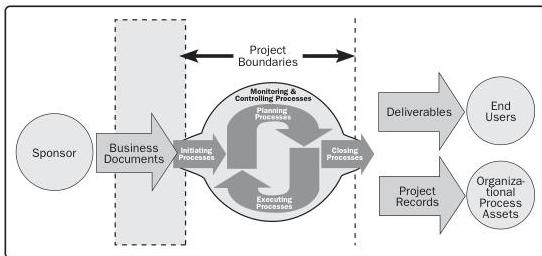

Business documents are documents that are generally originated outside of the project but are used as inputs to the project. Examples of business documents include the business case and benefits management plan. Figure 4-1 shows the sponsor and the business documents in relation to the Initiating Processes.

Figure 4-1. Project Boundaries

Projects are often divided into phases. When this is done, information from processes in the Initiating Process Group is reexamined to determine if the information is still valid. Revisiting the Initiating processes at the start of each phase helps keep the project focused on the business need that the project was undertaken to address. The project charter, business documents, and success criteria are verified. The influence drivers, expectations, and objectives of the project stakeholders are reviewed.

70

Process Groups: A Practice Guide

PMI Member benefit licensed to: Segun Fatoki - 4510107. Not for distribution, sale, or reproduction.