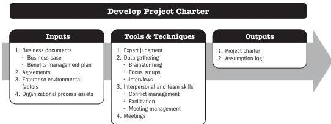

# Involve Stakeholders

Involving the sponsors, customers, and other stakeholders during initiation creates a shared understanding of success criteria. It also increases the likelihood of deliverable acceptance when the project is complete and stakeholder satisfaction throughout the project.

## 4.1 DEVELOP PROJECT CHARTER

Develop Project Charter is the process for developing the document that formally authorizes the existence of a project and provides the project manager with the authority to apply organizational resources to project activities. The key benefits of this process are:

- Provides a direct link between the project and the strategic objectives of the organization,
- Creates a formal record of the project, and
- Shows the organizational commitment to the project.

This process is performed once or at predefined points in the project. The inputs, tools and techniques, and outputs are shown in Figure 4-2. Figure 4-3 presents the data flow diagram for this process.

Note: This figure provides the inputs, tools and techniques, and outputs that may be used for this process. Descriptions for inputs and outputs appear in Section 9. Descriptions for tools and techniques appear in Section 10.

Figure 4-2. Develop Project Charter: Inputs, Tools & Techniques, and Outputs

Initiating Process Group

PMI Member benefit licensed to: Segun Fatoki - 4510107. Not for distribution, sale, or reproduction.

71