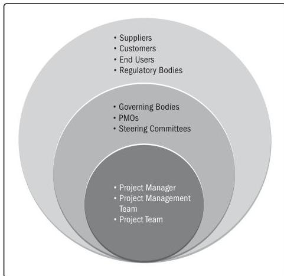

Projects are performed by people and for people. This performance domain entails working with stakeholders to maintain alignment and engaging with them to foster positive relationships and satisfaction.

Stakeholders include individuals, groups, and organizations (see Figure 2-2). A project can have a small group of stakeholders or potentially millions of stakeholders. There may be different stakeholders in different phases of the project, and the influence, power, or interests of stakeholders may change as the project unfolds.

Figure 2-2. Examples of Project Stakeholders

Section 2 – Project Performance Domains

9