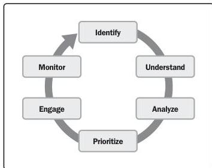

Effective stakeholder identification, analysis, and engagement includes stakeholders who are internal and external to the organization, those who are supportive of the project, and those who may not be supportive or are neutral. While having relevant technical project management skills is an important aspect of successful projects, having the interpersonal and leadership skills to work effectively with stakeholders is just as important, if not more so.

### 2.1.1 STAKEHOLDER ENGAGEMENT

Stakeholder engagement includes implementing strategies and actions to promote productive involvement of stakeholders. Stakeholder engagement activities start before or when the project starts and continue throughout the project.

Figure 2-3. Navigating Effective Stakeholder Engagement

10

PMBOK® Guide