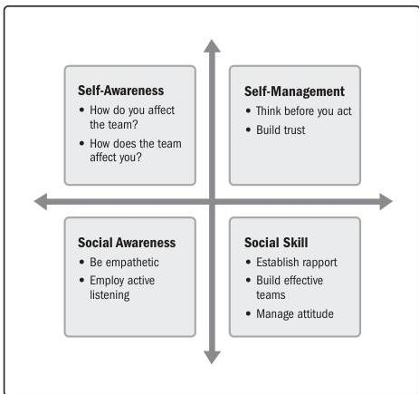

Figure 2-5. Components of Emotional Intelligence

Some models for emotional intelligence include a fifth area for motivation. Motivation in this context is about understanding what drives and inspires people.

- ▶ **Decision making.** Project managers and project teams make many decisions daily. Some decisions may be fairly inconsequential to the project outcome, such as where to go for a team lunch, and others will be very impactful, such as what development approach to use, which tool to use, or what vendor to select.

Section 2 – Project Performance Domains

27