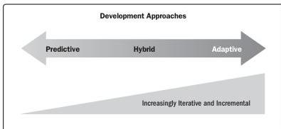

### 2.3.3 DEVELOPMENT APPROACHES

A development approach is the means used to create and evolve the product, service, or result during the project life cycle. There are different development approaches, and different industries may use different terms to refer to development approaches. Three commonly used approaches are predictive, hybrid, and adaptive. As shown in Figure 2-7, these approaches are often viewed as a spectrum, from the predictive approach on one end of the spectrum, to the adaptive on the other end.

Figure 2-7. Development Approaches

- ▶ **Predictive approach.** A predictive approach is useful when the project and product requirements can be defined, collected, and analyzed at the start of the project. This may also be referred to as a waterfall approach. This approach may also be used when there is a significant investment involved and a high level of risk that may require frequent reviews, change control mechanisms, and replanning between development phases. The scope, schedule, cost, resource needs, and risks can be well defined in the early phases of the project life cycle, and they are relatively stable. This development approach allows the project team to reduce the level of uncertainty early in the project and do much of the planning up front. Predictive approaches may use proof-of-concept developments to explore options, but the majority of the project work follows the plans that were developed near the start of the project. Many times, projects that use this approach have templates from previous, similar projects.

Section 2 – Project Performance Domains

35