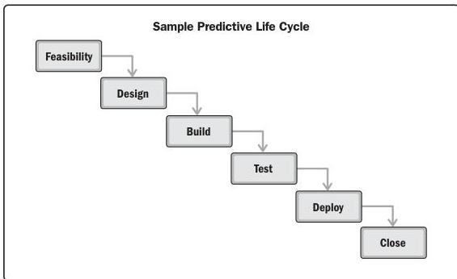

Figure 2-9 shows a life cycle where one phase finishes before the next one begins. This type of life cycle would fit well with a predictive development approach since each phase is only performed once, and each phase focuses on a particular type of work. However, there are situations, such as adding scope, a change in requirements, or a change in the market that cause phases to be repeated.

Figure 2-9. Sample Predictive Life Cycle

Section 2 – Project Performance Domains

43