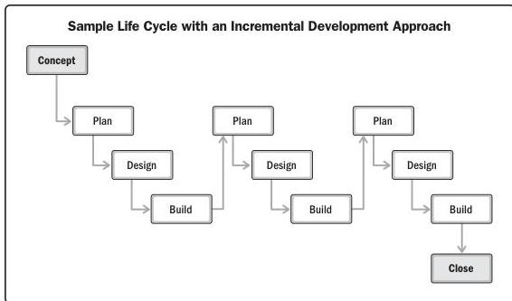

Figure 2-10 shows a life cycle with an incremental development approach. There are three iterations of plan, design, and build shown in this example. Each subsequent build would add functionality to the initial build.

Figure 2-10. Life Cycle with an Incremental Development Approach

44

PMBOK® Guide