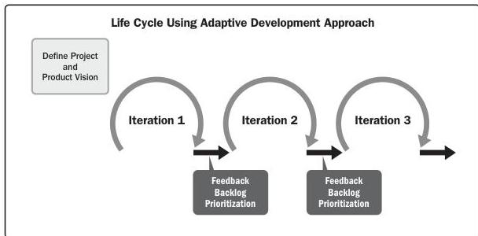

Figure 2-11 shows a life cycle using an adaptive development approach. At the end of each iteration (sometimes known as a *sprint*), the customer reviews a functional deliverable. At the review, the key stakeholders provide feedback, and the project team updates the project backlog of features and functions to prioritize for the next iteration.

Figure 2-11. Life Cycle with Adaptive Development Approach

This approach can be modified for use in continuous delivery situations, as described in Section 2.3.2 on Delivery Cadence.

Several adaptive methodologies, including agile, use flow-based scheduling, which does not use a life cycle or phases. One goal is to optimize the flow of deliveries based on resource capacity, materials, and other inputs. Another goal is to minimize time and resource waste and optimize the efficiency of processes and the throughput of deliverables. Projects that use these practices and methods usually adopt them from the Kanban scheduling system used in lean and just-in-time scheduling approaches.

Section 2 – Project Performance Domains

45