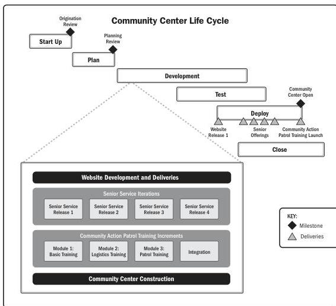

Figure 2-12 shows a possible life cycle for the community center project. The start-up and planning phases are sequential. The development, test, and deploy phases overlap because the different deliverables will be developed, tested, and deployed at different times, and some deliverables will have multiple deliveries. The development phase is shown in more detail to demonstrate different timing and delivery cadence. The test phase cadence would follow the development phase cadence. The deliveries are shown in the deploy phase.

Figure 2-12. Community Center Life Cycle

48

PMBOK® Guide