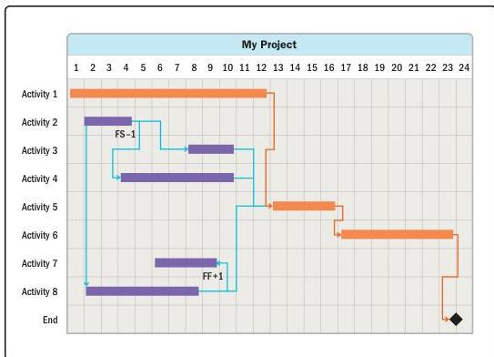

Figure 2-16. Fast Tracking Examples

When compressing the schedule, it is important to determine the nature of the dependencies between activities. Some activities cannot be fast tracked due to the nature of the work—others can. The four types of dependencies are:

- ▶ **Mandatory dependency.** A relationship that is contractually required or inherent in the nature of the work. This type of dependency usually cannot be modified.
- ▶ **Discretionary dependency.** A relationship that is based on best practices or project preferences. This type of dependency may be modifiable.
- ▶ **External dependency.** A relationship between project activities and non-project activities. This type of dependency usually cannot be modified.
- ▶ **Internal dependency.** A relationship between one or more project activities. This type of dependency may be modifiable.

60

PMBOK® Guide