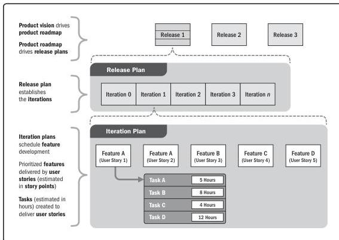

Adaptive schedule planning uses incremental planning. One such scheduling approach is based on iterations and releases (see Figure 2-17). A high-level release plan is developed that indicates the basic features and functionality to be included in each release. Within each release, there will be two or more iterations. Each iteration adds business and/or stakeholder value. Value may include features, risk reduction, experimentation, or other ways of delivering or protecting value. The planning for the work in future releases is kept at a high level so the project team does not engage in planning that could change based on feedback from earlier releases.

Figure 2-17. Release and Iteration Plan

Section 2 – Project Performance Domains

61